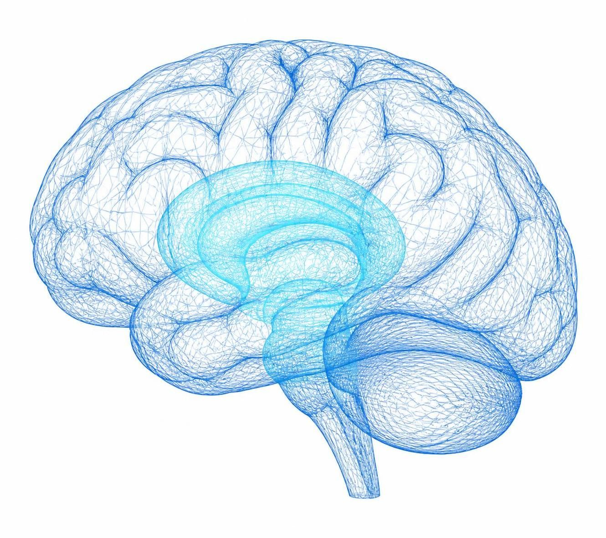
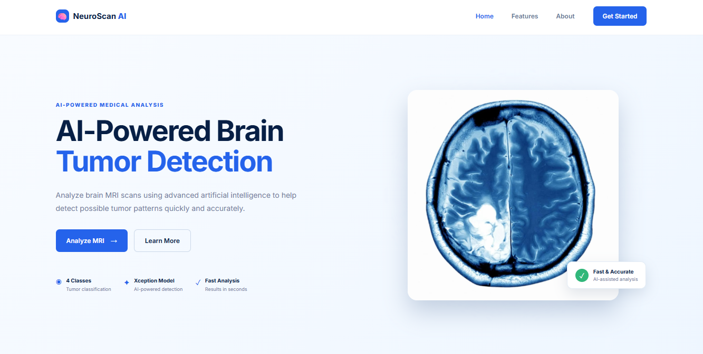
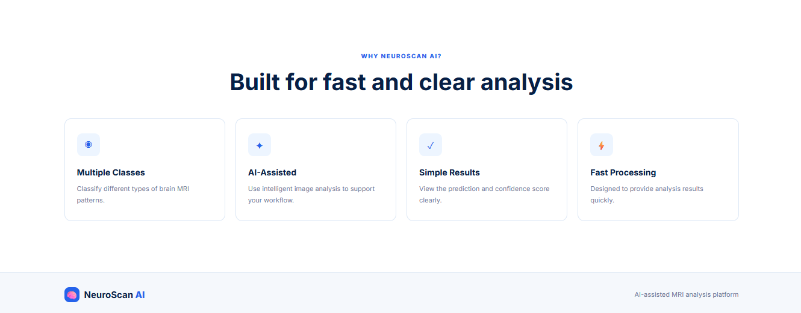

# 🧠 NeuroScan AI

### AI-Powered Brain Tumor Classification from MRI Scans

> **Deep Learning • Transfer Learning • Flask**

NeuroScan AI is an end-to-end **Deep Learning **project designed to classify brain MRI images into four different categories.

The system uses **Transfer Learning with Xception**, trained on brain MRI images, and provides a web-based interface built with **Flask** for real-time image prediction.

---

## ✨ What Makes NeuroScan AI?

NeuroScan AI isn't just a trained model.

It is a complete pipeline that takes the project from:

```text
📂 MRI Dataset
      ↓
🧹 Data Preparation
      ↓
🔍 Image Preprocessing
      ↓
🧠 Transfer Learning
      ↓
🚀 Xception Model
      ↓
📊 Model Evaluation
      ↓
💾 Model Serialization
      ↓
🌐 Flask Web Application
      ↓
🔮 MRI Prediction
```

---

## 🎯 Supported Classes

The model predicts one of four categories

| Class             | Prediction        |
| ----------------- | ----------------- |
| 🧠 **Glioma**     | Glioma tumor      |
| 🧠 **Meningioma** | Meningioma tumor  |
| 🟢 **No Tumor**   | No tumor detected |
| 🧠 **Pituitary**  | Pituitary tumor   |

---

# 🧠 Deep Learning Model

The core of NeuroScan AI is an **Xception-based image classification model** using Transfer Learning.

### Why Xception?

Xception provides a powerful convolutional architecture capable of extracting meaningful visual features from complex medical images while benefiting from pre-trained ImageNet representations.

### Model Pipeline

```text
MRI Image
   │
   ▼
224 × 224 × 3
   │
   ▼
Xception
ImageNet Pretrained
   │
   ▼
Global Max Pooling
   │
   ▼
Flatten
   │
   ▼
Dropout 0.30
   │
   ▼
Dense 128
ReLU
   │
   ▼
Dropout 0.25
   │
   ▼
Dense 4
Softmax
   │
   ▼
Prediction
```

---

# 📊 Model Performance

### Accuracy

## 🎯 **94.75% Accuracy**

The model was evaluated using:

* Accuracy
* Precision
* Recall

The final model achieved approximately **94.75% classification accuracy** on the evaluation data.

> Performance can vary depending on the dataset split and inference data.

---

# 🔬 Computer Vision Pipeline

The input MRI image goes through several preprocessing steps before prediction.

### Image Processing

```text
Original MRI
     ↓
Image Resize
     ↓
224 × 224
     ↓
Pixel Normalization
     ↓
Xception Feature Extraction
     ↓
Classification
```

The application also calculates the probability distribution across all four classes, allowing the result page to display the model's confidence for each prediction.

---

# 🌐 Flask Web Application

NeuroScan AI includes a Flask-based web application that connects the trained Deep Learning model with a user-friendly interface.

### User Flow

```text
Upload MRI
     ↓
Image Preview
     ↓
Preprocessing
     ↓
Deep Learning Model
     ↓
Prediction
     ↓
Confidence Scores
     ↓
Result Dashboard
```

### Features

* 📤 MRI image upload
* 🖼️ Image preview
* 🧠 AI-based classification
* 📊 Prediction probabilities
* ⚡ Fast inference
* 🌐 Flask backend
* 🎨 Custom responsive UI

---

# 🖥️ Interface

### Home Page


### Brain MRI



### NeuroScan AI



### NeuroScan AI



---

# 🛠️ Tech Stack

### AI / Machine Learning

* Python
* TensorFlow
* Keras
* Xception
* NumPy
* Pillow

### Computer Vision

* Image preprocessing
* Image classification
* Transfer Learning
* Feature extraction

### Backend

* Flask

### Frontend

* HTML
* CSS
* JavaScript

### Tools

* Jupyter Notebook
* Git
* GitHub
* Git LFS

---

# 📁 Project Structure

```text
NeuroScan-AI/
│
├── 📁 ImageTest/
│   ├── Te-gl_26.jpg
│   ├── Te-me_9.jpg
│   ├── Te-no_4.jpg
│   └── Te-pi_6.jpg
│
├── 📁 Notebook/
│   └── Brain Tumor Detection.ipynb
│
├── 📁 static/
│   ├── 📁 Css/
│   │   └── style.css
│   │
│   └── 📁 Images/
│       ├── Brain1.png
│       ├── Brain2.png
|       └── InterFace.jpg
|       └── Feature.jpg   
│
├── 📁 templates/
│   └── index.html
│
├── app.py
├── brain_tumor_model.keras
├── class_indices.json
├── requirements.txt
├── .gitignore
└── .gitattributes
```

---

# ⚙️ Installation

## 1. Clone the Repository

```bash
git clone https://github.com/AiOmarAdel/NeuroScan-AI.git
```

```bash
cd NeuroScan-AI
```

---

## 2. Create Virtual Environment

```bash
python -m venv venv
```

### Windows

```bash
venv\Scripts\activate
```

---

## 3. Install Dependencies

```bash
pip install -r requirements.txt
```

---

# 🚀 Run the Application

Start the Flask server:

```bash
python app.py
```

Then open the local Flask URL displayed in the terminal.

---

# 📓 Model Development

The complete experimentation and model development process is available in:

```text
Notebook/Brain Tumor Detection.ipynb
```

The notebook covers:

* Dataset loading
* Data exploration
* Image preprocessing
* Data augmentation
* Transfer Learning
* Xception model
* Model training
* Evaluation
* Prediction
* Model saving

---

# 💾 Model Storage

The trained model:

```text
brain_tumor_model.keras
```

is approximately **242 MB**.

Because GitHub has a 100 MB limit for normal Git files, the model is managed using:

### Git LFS

```text
GitHub
   │
   ├── Source Code
   ├── Notebook
   ├── Web Interface
   └── Git LFS
          │
          └── brain_tumor_model.keras
```

---

# 🚀 Future Improvements

NeuroScan AI can be extended with:

### 🔬 Explainable AI

Integrate **Grad-CAM** to visualize which regions of an MRI influenced the prediction.

### 📊 Advanced Evaluation

Add:

* Confusion Matrix
* ROC-AUC
* F1 Score
* Per-class metrics

### ☁️ Deployment

Deploy the application using cloud infrastructure and expose the model through an API.

### ⚡ Optimization

Convert and optimize the model for faster inference using suitable model optimization techniques.

### 📱 User Experience

Improve the interface for mobile devices and add a more advanced prediction dashboard.

---

# 🧠 Learning Outcomes

This project helped demonstrate practical experience with:

* Deep Learning
* Convolutional Neural Networks
* Transfer Learning
* Xception
* Image preprocessing
* Multi-class classification
* Model evaluation
* TensorFlow / Keras
* Flask deployment
* Git & GitHub
* Git LFS

---

# 👨‍💻 About the Developer

## Omar Adel

**AI Student | Machine Learning | Deep Learning | MLops| LLM |Computer Vision**

Interested in building practical AI systems and transforming Machine Learning models into real-world applications.

### Areas of Interest

`Machine Learning` • `Deep Learning` • `Computer Vision` • `LLMs` • `Robotics` • `AI Engineer`

---

# ⭐ Support

If you find this project interesting, consider giving it a ⭐ on GitHub.

---

# ⚠️ Medical Disclaimer

NeuroScan AI is an **Educational and Research Project**.

The predictions generated by this system should **not be considered a medical diagnosis** and should not be used as a substitute for evaluation by qualified healthcare professionals.
